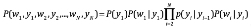
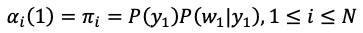
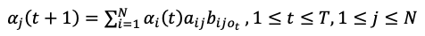

## HMM语言模型

句子词性作为隐式状态Y，单词作为显示状态W，在HMM model中，所有变量的联合概率密度分布为：



#### 一、The forward procedure

**1. Initialization**



初始化，由于初始词的没有先导词的词性对其进行约束，故初值π的求法如上式。代码如下：

```python
# tag = {}     tag: frequency
# word_tag = {}    word: [tags]
#    word_tag_freq = {}   (word, tag): frequency
def init(firstword):
    if word_tag.__contains__(firstword):
        tagset = word_tag[firstword]
    else:
        return 0
    curval = 0
    for t in tagset:
        curval += tag[t] * word_tag_freq[(firstword, t)]
    return curval
```

**2. Induction**



如上递推关系式，下一词的HMM值由当前词的词性及其先导词的词性决定，由于各词的词性可能不止一种，故这里的搭配多样，对这些值求和即所求HMM值。 在train集中求出的词对搭配等数据，在valid和test中可能该词性搭配不合法或者没出现，故计算时需要判断。代码如下：

```python
def HMMcalculate(preword, curword):
    curval = 0
    if word_tag.__contains__(preword):
        p_tagset = word_tag[preword]
    else:
        return 0
    if word_tag.__contains__(curword):
        curtagset = word_tag[curword]
    else:
        return 0
    for cur in curtagset:
        for pre in p_tagset:
              # pair_tag = {}   (currenet_tag, previous_tag): frequency
            if not pair_tag.__contains__((cur, pre)):
                pair_tag.update({(cur, pre): 0})
            else:
                curval += pair_tag[(cur, pre)] * word_tag_freq[(curword, cur)]
    return curval
```

**3. Total**


要求句子*S*在HMM model的概率值，则是对联合概率密度值求和。代码如下：

```python
def forwardHMM(sentence):
    value = []
    for i in range(len(sentence) - 1):
        if i == 0:
            PI = init(sentence[0])
            value.append(PI)
        else:
            temp = HMMcalculate(sentence[i], sentence[i + 1])
            value.append(temp)
    return(np.prod(value))
```

#### 二、分析

从本质上来看，N-gram语言模型是考虑了N个词语之间的前后关系，第n个词与之前的n - 1个词有关，即n值越大，N-gram模型估计值会更加准确。由HMM model的三个假设，其中齐次性假设指出HMM chain的任意时刻t的状态只依赖于前一时刻的状态，这一点在实验过程中可以很明显的体现出来，当前词的HMM值仅由其前一词的词性决定。HMM model由初始概率分布、状态转移概率和观测分布确定。在自然语言处理过程中，尤其是对汉语处理，多词性等问题在N-gram模型中没有办法解决，在HMM中我们由状态转移概率矩阵来存储其词性的分布值，约束条件的增多使得观测应用的场合更广，结果更加精确。

如之前处理Induction时提到，由于语料库很小，HMM和N-gram模型都需要就行平滑处理，但在HMM model中词性和词对的搭配关系不比N-gram中简明，我认为可以针对词性搭配出现的频率来采取不同的平滑处理，可以得到更好的结果。
